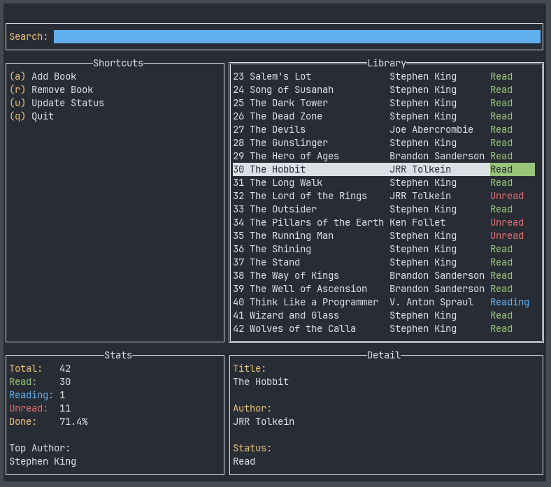

# Personal Book Tracker
A terminal-based book tracking app written in Go, built with [tview](https://github.com/rivo/tview).



## Features
- Add, remove, and search books by title or author
- Track read status - Unread, Reading, or Read
- Live search filtering across the whole library
- Library stats including completion percentage and top author
- Saves automatically to a local `books.json` file

## Installation
```bash
git clone https://github.com/LunarDrift/go-book-tracker
cd go-book-tracker
go mod tidy
go run .
```

## Keybinds

| Key     | Action                        |
| ------- | ----------------------------- |
| `a`     | Add Book                      |
| `r`     | Remove selected book          |
| `u`     | Update selected book's status |
| `/`     | Focus search bar              |
| `Enter` | Cycle status of selected book |
| `Esc`   | Return focus to book list     |
| `q`     | Quit                          |


## Data
Books are stored in `.book-tracker/books.json` in the user's home directory. The file is created automatically on the first run.
